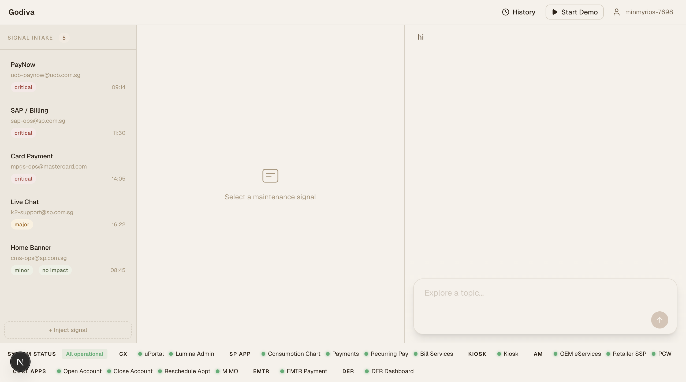
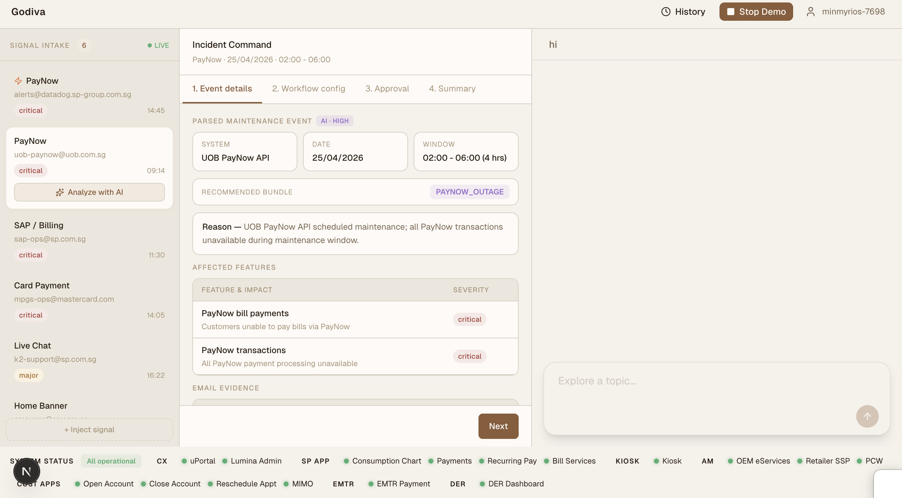
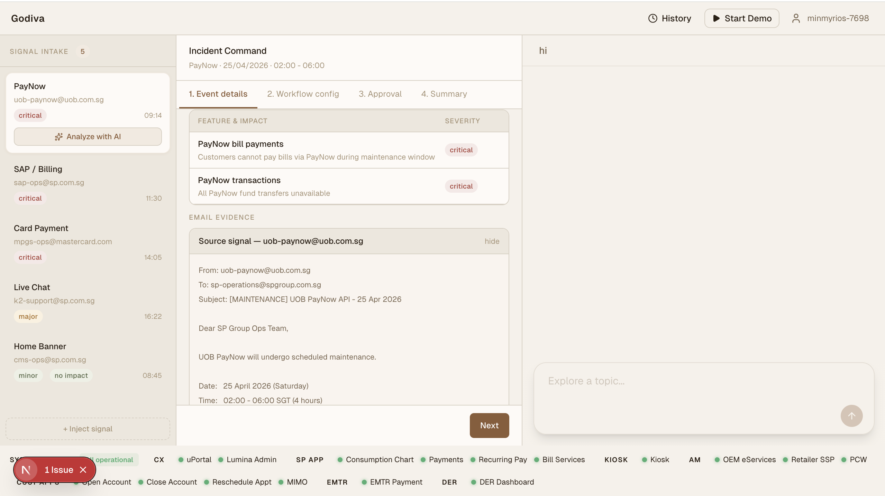
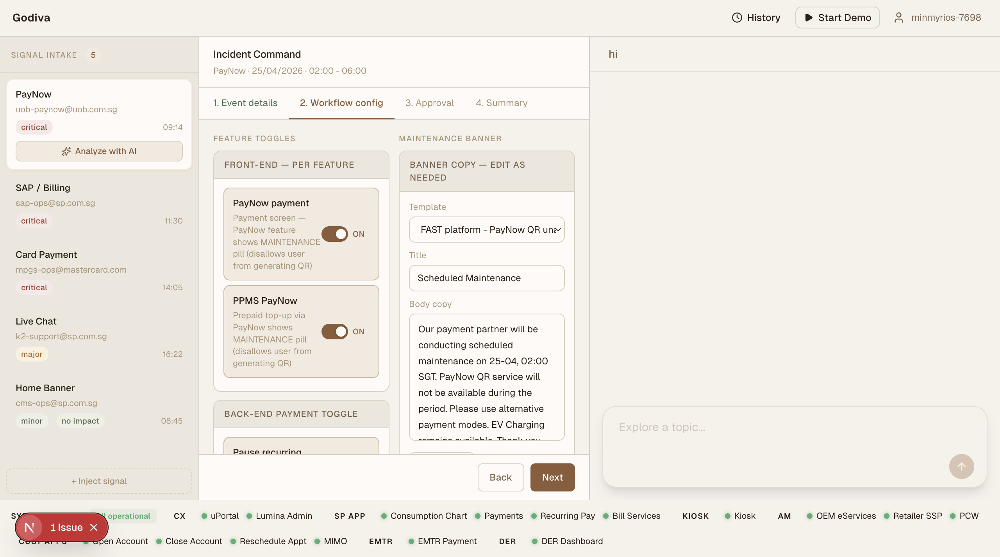
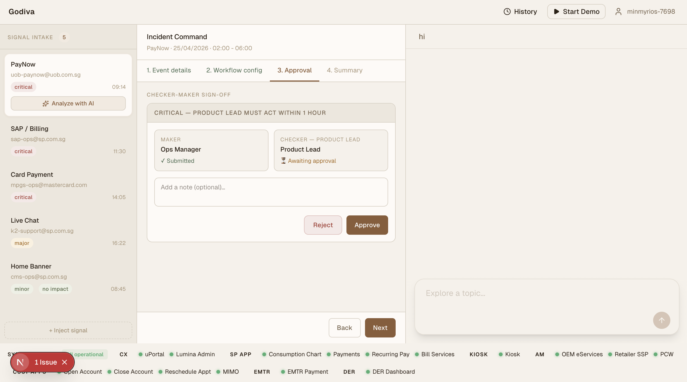
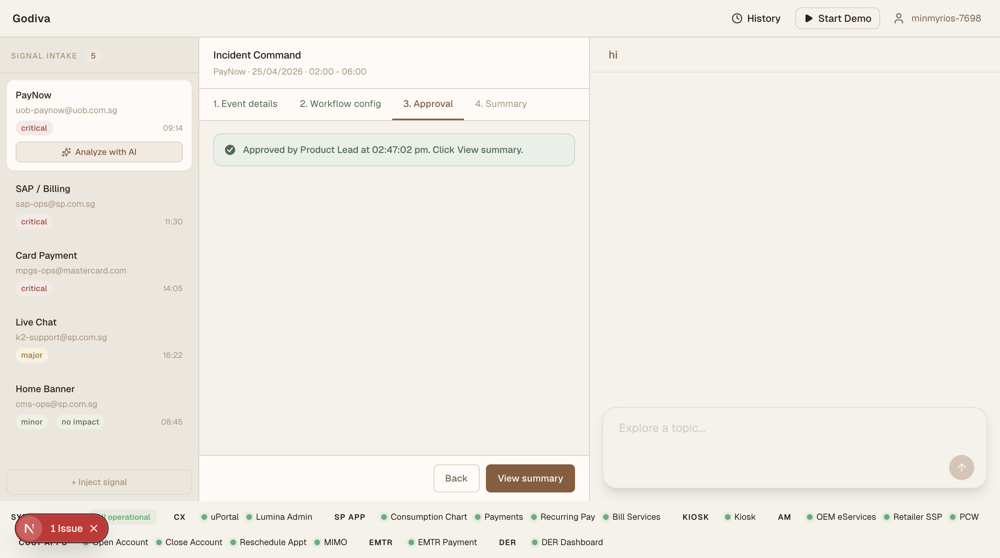

# Project Godiva

AI-driven service event automation. Ingests operational signals (emails, monitoring alerts, manual triggers), classifies incident severity with an Anthropic Managed Agent, and executes response actions through a mock feature-flag bundle model across App, uPortal, and Kiosk channels.

**Demo video:** https://drive.google.com/file/d/1mjpX0w9lGXQmAg17XShLJ4zw5q6WQ-Z6/view?usp=drive_link

## Screens








## Tracks

- **Track 1 — Admin Dashboard & Feature Control.** Single operator portal where the PO reviews AI recommendations, toggles feature bundles across 20+ domains (Payment, Core, Channel, Support, EV, Content, Infrastructure, …) at Critical/Major/Minor tiers, publishes app banners, and confirms actions in one click. Every action is logged to a Service Event ID.
- **Track 2 — AI Event Decisioning & Signal Intake.** Interprets incoming vendor signals, classifies severity, maps affected features, and generates recommended actions and SOPs. Human approves before anything executes (checker-maker).

## Signal-to-execution flow

1. Operational signal arrives (email / alert / manual inject)
2. Anthropic Managed Agent interprets signal → classifies severity → recommends flag bundle + SOP
3. Approval gate — Critical incidents require Product + Engineering Lead sign-off within 1 hour
4. Execution layer applies flag changes across all three channels simultaneously

## Stack

Next.js 16 (App Router, Turbopack) · Better Auth (Sign in with Vercel) · Neon PostgreSQL via Drizzle ORM · `@anthropic-ai/sdk` beta managed sessions · Vercel Workflow SDK for durable polling · shadcn/ui + Tailwind CSS v4 · TypeScript strict.

Agent interaction is **poll-based, not streaming** — the server-side Workflow polls Anthropic every 10s, persists events to Postgres, and the UI fetches via REST.

## Getting started

All code lives in [`claude-managed-agents/`](claude-managed-agents/). Run commands from there using `pnpm`:

```bash
pnpm install
pnpm dev          # Dev server (Turbopack)
pnpm build        # Production build
pnpm lint         # ESLint
pnpm db:generate  # Generate Drizzle migrations
pnpm db:push      # Push schema to Neon
pnpm skills:sync  # Upload Godiva agent skills to Anthropic
```

See [`claude-managed-agents/AGENTS.md`](claude-managed-agents/AGENTS.md) for the authoritative stack reference, environment variables, and project structure.

## Documentation

| Doc | Covers |
| --- | --- |
| [`claude-managed-agents/AGENTS.md`](claude-managed-agents/AGENTS.md) | Stack, constraints, env vars, project structure, end-to-end flow |
| [`claude-managed-agents/docs/SPEC.md`](claude-managed-agents/docs/SPEC.md) | User flows, API contracts, tailing workflow, security model |
| [`claude-managed-agents/docs/ARCHITECTURE.md`](claude-managed-agents/docs/ARCHITECTURE.md) | Routing, layout hierarchy, key directories |
| [`claude-managed-agents/docs/DATA_MODEL.md`](claude-managed-agents/docs/DATA_MODEL.md) | Drizzle schema, DB conventions, migrations |
| [`claude-managed-agents/docs/AUTH.md`](claude-managed-agents/docs/AUTH.md) | Better Auth + Vercel OAuth setup |
| [`claude-managed-agents/docs/UI_CONVENTIONS.md`](claude-managed-agents/docs/UI_CONVENTIONS.md) | shadcn/base-ui patterns, layout rules, taste preferences |

## Agent skills

The Godiva Managed Agent uses four custom skills in [`claude-managed-agents/skills/`](claude-managed-agents/skills/):

| Skill | Purpose |
| --- | --- |
| `godiva-ld-reference` | Full LaunchDarkly bundle/flag/severity lookup |
| `godiva-severity-rules` | Critical/Major/Minor tiers, approval gates, blast radius |
| `godiva-signal-schema` | Extraction schema for maintenance emails and alerts |
| `godiva-sop-playbook` | SOP templates for Critical, Major, and Minor incidents |

After editing any `SKILL.md`, run `pnpm skills:sync` from `claude-managed-agents/` to upload a new version.
